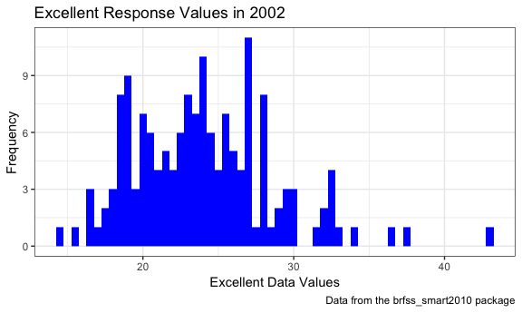
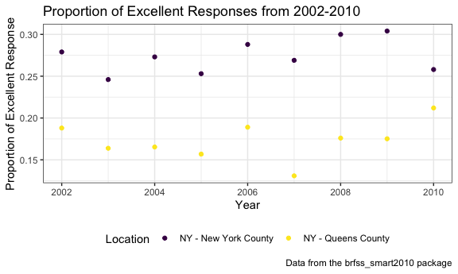

Homework \#2 - deg2163
================
Diana Ballesteros Gonzalez
9/30/2018

**Problem 1**
=============

``` r
## Loading the library
library(tidyverse)
library(ggridges)
```

``` r
## Load the transit_data
transit_data = 
  read_csv(file = "./data/NYC_Transit_Subway_Entrance_And_Exit_Data.csv", col_types = "cccddcccccccccccccccccccccccddcc")

## Clean the data 
transit_data_clean = 
  read_csv(file = "./data/NYC_Transit_Subway_Entrance_And_Exit_Data.csv", col_types = "cccddcccccccccccccccccccccccddcc") %>% 
  janitor::clean_names() %>% 
  select(line:vending, ada) %>% 
  mutate(entry = tolower(entry),
    entry = recode(entry, "yes" = TRUE, "no" = FALSE))
```

### Step by Step Explanation

The variables contained in this new clean data file are line, station, name, station latitude / longitude, routes served (1 through 11), entry, vending, entrance type, and ADA compliance. The first thing I did was create a new dataset called "transit\_data\_clean" to distinguish it from the raw dataset. Then, I read in the raw dataset and input read\_csv since it was a csv file using a relative path to make sure that I am able to pull in that data set if shared with others. Then, I used the janitor package to clean up the variable names to change the names to snake and lowercase. After, I selected only the variables that were requested by including all the columns from line to vending, then adding ADA compliance to the end. I then made all the rows within the entry variable lowercase by using tolower before recoding all the yes to equal 1 and no's to equal 0. The data is not yet tidy since some variables have not been recoded yet (e.g., vending).

### Problem 1 Answers

``` r
## Created a new table with distinct stations 
transit_data_distinct = 
  distinct(transit_data_clean, station_name, line, .keep_all = TRUE) %>% 
  mutate(ada = as.logical(ada))
```

-   The are 465 distinct stations.
-   There are 84 stations that are ADA compliant.
-   The proportion of station entrances/exits without vending allow entrance is 0.5555556

``` r
## Reformatted data so that route number and route name are distinct variables. 
transit_data_distinct_reformat = 
  read_csv(file = "./data/NYC_Transit_Subway_Entrance_And_Exit_Data.csv") %>% 
  janitor::clean_names() %>% 
  distinct(transit_data_clean, station_name, line, .keep_all = TRUE) %>% 
  gather(key = "route_number", value = "route", route1:route11)
```

    ## Warning: Trying to compute distinct() for variables not found in the data:
    ## - `transit_data_clean`
    ## This is an error, but only a warning is raised for compatibility reasons.
    ## The following variables will be used:
    ## - station_name
    ## - line

-   There are 60 stations that serve the A train. Of the 60 stations that serve the A train, 17 are ADA compliant.

**Problem 2**
=============

``` r
## Importing Mr. Trash Wheels dataset
water_wheels_clean = 
  readxl::read_excel("./data/HealthyHarborWaterWheelTotals2018-7-28.xlsx", sheet = 1, 
                     range = "A2:N336") %>% 
  janitor::clean_names() %>% 
  filter(!is.na(dumpster)) %>% 
  mutate(sports_balls = round(as.integer(sports_balls)))
```

``` r
## load the precipitation_2017 data 
precipitation_2017_clean = 
  readxl::read_excel("./data/HealthyHarborWaterWheelTotals2018-7-28.xlsx", sheet = 4, range = "A2:B14") %>% 
  janitor::clean_names()  %>% 
  mutate(year = 2017)

## load the precipitation_2016 data 
precipitation_2016_clean = 
  readxl::read_excel("./data/HealthyHarborWaterWheelTotals2018-7-28.xlsx", sheet = 5, range = "A2:B14") %>% 
  janitor::clean_names() %>% 
  mutate(year = 2016)

## binding the rows from both data sets 
precipitation_data = 
  bind_rows(precipitation_2016_clean, precipitation_2017_clean) %>% 
  mutate(month = month.name[month])
```

### Problem 2 Answers

-   The number of observations in the water\_wheels\_clean data set is 285.
-   The number of observations in the precipitation data set is 24.
-   Some examples of key variables for Mr. Water Wheels are month, year, and weight\_tons. Some examples of key variables for precipitation\_data are month, year, and total precipitation during that year.
-   For available data, the total precipitation in 2017 was 32.93
-   The median number of sports balls in a dumpster in 2016 is 26

**Problem 3**
=============

``` r
# install.packages("devtools")
devtools::install_github("p8105/p8105.datasets")
```

    ## Skipping install of 'p8105.datasets' from a github remote, the SHA1 (21f5ad1c) has not changed since last install.
    ##   Use `force = TRUE` to force installation

``` r
## loading the library and obtaining data
library(p8105.datasets)
data("brfss_smart2010")

## creating the brfss_smart2010_df
brfss_smart2010 = 
   brfss_smart2010 %>% 
   janitor::clean_names() %>% 
   filter(topic == "Overall Health") %>% 
   select(-class, -topic, -question, -sample_size, -(confidence_limit_low:geo_location)) %>% 
   spread(., key = response, value = data_value) %>%
   janitor::clean_names() %>% 
   mutate(excellent_very_good = excellent + very_good)
```

### Problem 3 Answers

-   There are 404 unique location included in the database
-   Every state is represented. In fact 51 states (including Washington DC) are represented.
-   The median of the “Excellent” response value is 23.6
-   The state that is observed the most is NJ, 146.

``` r
## A histogram of “Excellent” response values in the year 2002.
brfss_smart2010 %>% 
  filter(year == 2002) %>% 
  ggplot(aes(x = excellent)) + 
  geom_histogram(binwidth = 0.50, fill = "Blue") + 
  labs(
    title = "Excellent Response Values in 2002",
    x = "Excellent Data Values",
    y = "Frequency",
    caption = "Data from the brfss_smart2010 package"
  ) + 
  theme_bw() 
```

    ## Warning: Removed 2 rows containing non-finite values (stat_bin).



``` r
## Created a scatterplot
brfss_smart2010 %>% 
  filter(locationdesc == "NY - Queens County" | locationdesc ==  "NY - New York County") %>% 
  mutate(prop_excellent =  
    excellent / (excellent + fair + good + poor + very_good)
  ) %>% 
  ggplot(aes(x = year, y = prop_excellent, color = locationdesc)) +
  geom_point() + 
  labs(
    title = "Proportion of Excellent Responses from 2002-2010",
    x = "Year",
    y = "Proportion of Excellent Response",
    caption = "Data from the brfss_smart2010 package"
  ) + 
  viridis::scale_color_viridis(
    name = "Location", 
    discrete = TRUE) + 
  theme_bw() + 
  theme(legend.position = "bottom")
```


