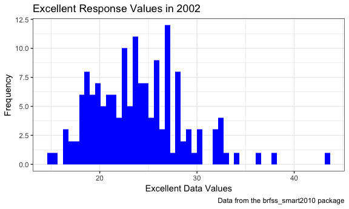
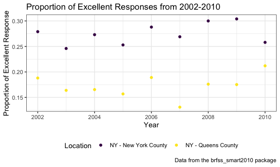

Homework \#2 - deg2163
================
Diana Ballesteros Gonzalez
9/30/2018

**Problem 1**
=============

``` r
## Loading the library
library(tidyverse)
library(ggridges)
```

``` r
## Load the transit_data
transit_data = 
  read_csv(file = "./data/NYC_Transit_Subway_Entrance_And_Exit_Data.csv", col_types = "cccddcccccccccccccccccccccccddcc")

## Clean the data 
transit_data_clean = 
  read_csv(file = "./data/NYC_Transit_Subway_Entrance_And_Exit_Data.csv", col_types = "cccddcccccccccccccccccccccccddcc") %>% 
  janitor::clean_names() %>% 
  select(line:vending, ada) %>% 
  mutate(entry = tolower(entry),
    entry = recode(entry, "yes" = TRUE, "no" = FALSE))
```

### Step by Step Explanation

The variables contained in this new clean data file are line, station, name, station latitude / longitude, routes served (1 through 11), entry, vending, entrance type, and ADA compliance. The first thing I did was create a new dataset called "transit\_data\_clean" to distinguish it from the raw dataset. Then, I read in the raw dataset and input read\_csv since it was a csv file using a relative path to make sure that I am able to pull in that data set if shared with others. Then, I used the janitor package to clean up the variable names to change the names to snake and lowercase. After, I selected only the variables that were requested by including all the columns from line to vending, then adding ADA compliance to the end. I then made all the rows within the entry variable lowercase by using tolower before recoding all the yes to equal 1 and no's to equal 0. The data is not yet tidy since some variables have not been recoded yet (e.g., vending).

### Answering Problem 1 Questions

``` r
## Created a new table with distinct stations 
transit_data_distinct = 
  distinct(transit_data_clean, station_name, line, .keep_all = TRUE) %>% 
  mutate(ada = as.logical(ada))
```

-   The are 465 distinct stations.
-   There are 84 stations that are ADA compliant.
-   The proportion of station entrances/exits without vending allow entrance is 0.5555556

``` r
## Reformatted data so that route number and route name are distinct variables. 
transit_data_distinct_reformat = 
  read_csv(file = "./data/NYC_Transit_Subway_Entrance_And_Exit_Data.csv") %>% 
  janitor::clean_names() %>% 
  gather(key = "route_number", value = "route", route1:route11)
```

    ## Parsed with column specification:
    ## cols(
    ##   .default = col_character(),
    ##   `Station Latitude` = col_double(),
    ##   `Station Longitude` = col_double(),
    ##   Route8 = col_integer(),
    ##   Route9 = col_integer(),
    ##   Route10 = col_integer(),
    ##   Route11 = col_integer(),
    ##   ADA = col_logical(),
    ##   `Free Crossover` = col_logical(),
    ##   `Entrance Latitude` = col_double(),
    ##   `Entrance Longitude` = col_double()
    ## )

    ## See spec(...) for full column specifications.

Of the stations that serve the A train, how many are ADA compliant?

**Problem 2**
=============

How to include cell\_cols(), keep getting error message
-------------------------------------------------------

``` r
water_wheels_clean = 
  readxl::read_excel("./data/HealthyHarborWaterWheelTotals2018-7-28.xlsx", sheet = 1, 
                     range = "A2:N336") %>% 
  janitor::clean_names() %>% 
  filter(!is.na(dumpster)) %>% 
  mutate(sports_balls = round(as.integer(sports_balls)))
```

Precipitation
-------------

``` r
## load the precipitation_2017 data 
precipitation_2017_clean = 
  readxl::read_excel("./data/HealthyHarborWaterWheelTotals2018-7-28.xlsx", sheet = 4, range = "A2:B14") %>% 
  janitor::clean_names()  %>% 
  mutate(year = 2017)

## load the precipitation_2016 data 
precipitation_2016_clean = 
  readxl::read_excel("./data/HealthyHarborWaterWheelTotals2018-7-28.xlsx", sheet = 5, range = "A2:B14") %>% 
  janitor::clean_names() %>% 
  mutate(year = 2016)

precipitation_data = 
  bind_rows(precipitation_2016_clean, precipitation_2017_clean) %>% 
  mutate(month = month.name[month])
```

Write a paragraph about these data; you are encouraged to use inline R. Be sure to note the number of observations in both resulting datasets, and give examples of key variables. For available data, what was the total precipitation in 2017? What was the median number of sports balls in a dumpster in 2016?
------------------------------------------------------------------------------------------------------------------------------------------------------------------------------------------------------------------------------------------------------------------------------------------------------------------

-   The number of observations in the water\_wheels\_clean data set is 285.
-   The number of observations in the precipitation data set is 24.
-   Some examples of key variables for Mr.Water Wheels are

What are key variables? You can choose what you want to say.

For the median, use summarize fxn

*Problem 3*
===========

``` r
# install.packages("devtools")
devtools::install_github("p8105/p8105.datasets")
```

    ## Skipping install of 'p8105.datasets' from a github remote, the SHA1 (21f5ad1c) has not changed since last install.
    ##   Use `force = TRUE` to force installation

``` r
library(p8105.datasets)

data("brfss_smart2010")

brfss_smart2010 = 
   brfss_smart2010 %>% 
   janitor::clean_names() %>% 
   filter(topic == "Overall Health") %>% 
   select(-class, -topic, -question, -sample_size, -(confidence_limit_low:geo_location)) %>% 
   spread(., key = response, value = data_value) %>%
   janitor::clean_names() %>% 
   mutate(excellent_very_good = excellent + very_good)
```

``` r
## How many unique locations are included in the dataset?
count(distinct(brfss_smart2010, locationdesc))
```

    ## # A tibble: 1 x 1
    ##       n
    ##   <int>
    ## 1   404

``` r
## Is every state represented?
count(distinct(brfss_smart2010, locationabbr)) 
```

    ## # A tibble: 1 x 1
    ##       n
    ##   <int>
    ## 1    51

``` r
## In 2002, what is the median of the “Excellent” response value?
brfss_smart2010 %>% 
  filter(year == 2002) %>% 
  summarize(median(excellent, na.rm = TRUE))
```

    ## # A tibble: 1 x 1
    ##   `median(excellent, na.rm = TRUE)`
    ##                               <dbl>
    ## 1                              23.6

``` r
## Make a histogram of “Excellent” response values in the year 2002.

brfss_smart2010 %>% 
  filter(year == 2002) %>% 
  ggplot(aes(x = excellent)) + 
  geom_histogram(binwidth = 0.55, fill = "Blue") + 
  labs(
    title = "Excellent Response Values in 2002",
    x = "Excellent Data Values",
    y = "Frequency",
    caption = "Data from the brfss_smart2010 package"
  ) + 
  theme_bw() 
```

    ## Warning: Removed 2 rows containing non-finite values (stat_bin).



``` r
## Make a scatterplot showing the proportion of “Excellent” response values in 
## New York County and Queens County (both in NY State) in each year from 2002 to 2010.
brfss_smart2010 %>% 
  filter(locationdesc == "NY - Queens County" | locationdesc ==  "NY - New York County") %>% 
  mutate(prop_excellent =  
    excellent / (excellent + fair + good + poor + very_good)
  ) %>% 
  ggplot(aes(x = year, y = prop_excellent, color = locationdesc)) +
  geom_point() + 
  labs(
    title = "Proportion of Excellent Responses from 2002-2010",
    x = "Year",
    y = "Proportion of Excellent Response",
    caption = "Data from the brfss_smart2010 package"
  ) + 
  viridis::scale_color_viridis(
    name = "Location", 
    discrete = TRUE) + 
  theme_bw() + 
  theme(legend.position = "bottom")
```


